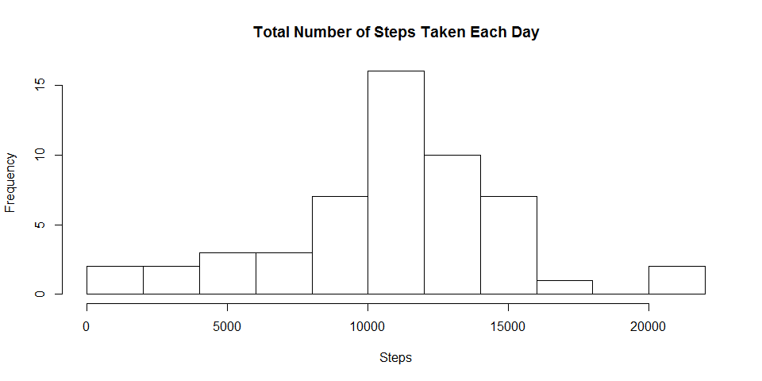
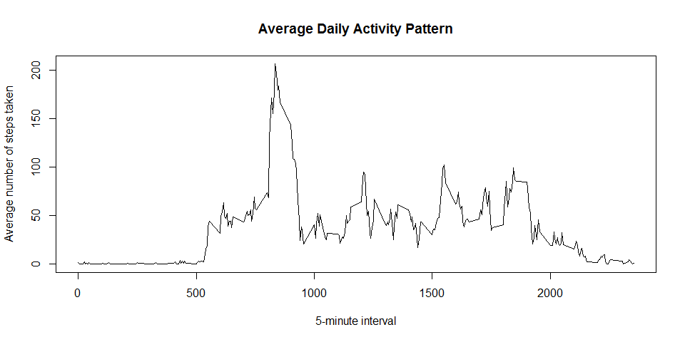
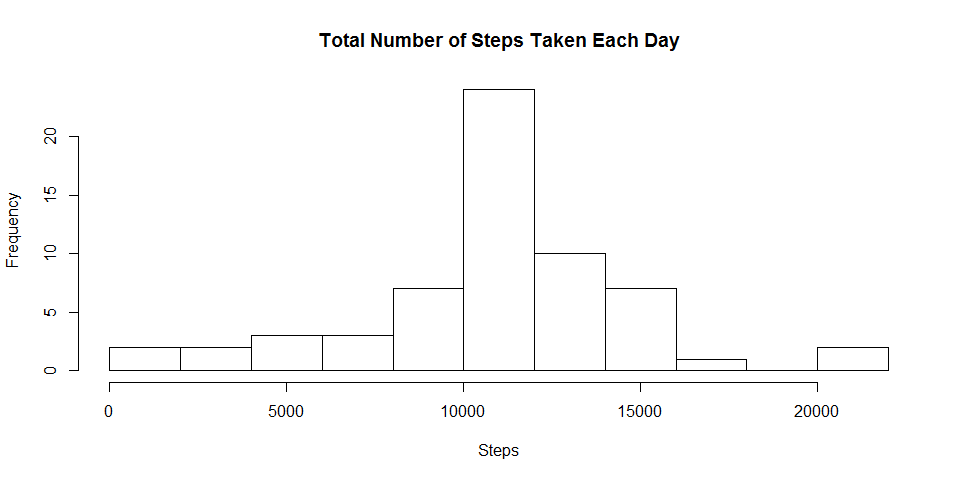
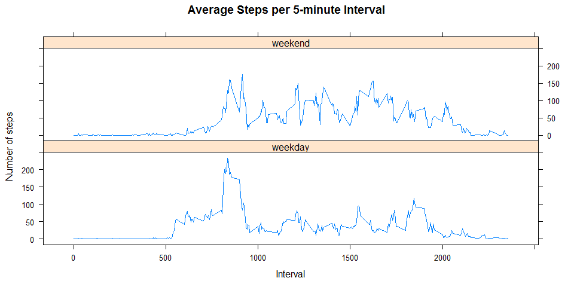

# Reproducible Research: Peer Assessment 1


## Loading and preprocessing the data

The dataset is downloaded and saved into your working directory.
It can be download from the following links: https://d396qusza40orc.cloudfront.net/repdata%2Fdata%2Factivity.zip

We will proceed by unzipping the zipped file and read the .csv file.
Then, we will process the data into a more suitable format for analysis.


```r
unzip("activity.zip")
data <- read.csv("activity.csv", header=TRUE, sep=",", na.strings="NA")

data$steps <- as.numeric(as.character(data$steps))
data$date <- as.Date(data$date, "%Y-%m-%d")
data$interval <- as.numeric(as.character(data$interval))
```

## What is mean total number of steps taken per day?

For this question, we will ignore all NA values.

```r
cleandata <-  data[!is.na(data$steps),]
```

1.Make a histogram of the total number of steps taken each day


```r
steps.day <- aggregate(cleandata$steps, by=list(cleandata$date), FUN=sum, na.rm=TRUE)
names(steps.day) <- c("date","sum_steps")

hist(steps.day$sum_steps, breaks=10, 
     main="Total Number of Steps Taken Each Day",
     xlab="Steps")
```

 

2.Calculate and report the mean and median total number of steps taken per day

The mean total number of steps taken per day is:

```r
steps.day.mean <- mean(steps.day$sum_steps)
print(steps.day.mean)
```

```
## [1] 10766.19
```

The median total number of steps taken per day is:

```r
steps.day.median <- median(steps.day$sum_steps)
print(steps.day.median)
```

```
## [1] 10765
```

## What is the average daily activity pattern?

1.Make a time series plot (i.e. type = "l") of the 5-minute interval (x-axis) and the average number of steps taken,      averaged across all days (y-axis)


```r
library("plyr")

steps.mean.interval <- ddply(cleandata, .(interval), summarize, steps = mean(steps))
plot(steps.mean.interval, 
     type="l",
     main="Average Daily Activity Pattern",
     xlab="5-minute interval", ylab="Average number of steps taken")
```

 

2.Which 5-minute interval, on average across all the days in the dataset, contains the maximum number of steps?

The maximum average steps taken is in the following interval:

```r
steps.mean.interval.max <- which.max(steps.mean.interval$steps)
print(steps.mean.interval$interval[steps.mean.interval.max])
```

```
## [1] 835
```
## Imputing missing values

1.Calculate and report the total number of missing values in the dataset (i.e. the total number of rows with NAs)

Number of missing values in the dataset is:

```r
sum(is.na(data$steps))
```

```
## [1] 2304
```

2.Devise a strategy for filling in all of the missing values in the dataset. The strategy does not need to be sophisticated. For example, you could use the mean/median for that day, or the mean for that 5-minute interval, etc.

The solution is to fill all the NA values with the mean of the same 5 minute interval.

3.Create a new dataset that is equal to the original dataset but with the missing data filled in.


```r
new.data <- data
steps.mean.interval.unique <- steps.mean.interval[!duplicated(steps.mean.interval),]

for (i in 1:nrow(new.data)) {
    if (is.na(new.data[i, "steps"])){
        x <- new.data[i, "interval"]
        y <- steps.mean.interval.unique[steps.mean.interval.unique$interval == x,]
        new.data[i,"steps"] <- y$steps
        }
}
```

4a. Make a histogram of the total number of steps taken each day

The histogram of the total number of steps taken each day:

```r
new.steps.day <- aggregate(new.data$steps, by=list(new.data$date), FUN=sum, na.rm=TRUE)
names(new.steps.day) <- c("date","sum_steps")

hist(new.steps.day$sum_steps, breaks=10, 
     main="Total Number of Steps Taken Each Day",
     xlab="Steps")
```

 

4b. Calculate and report the mean and median total number of steps taken per day.

The mean total number of steps taken per day based on the new dataset:

```r
mean(new.steps.day$sum_steps)
```

```
## [1] 10766.19
```

The median total number of steps taken  per day:

```r
median(new.steps.day$sum_steps)
```

```
## [1] 10766.19
```

4c. Do these values differ from the estimates from the first part of the assignment? 
4d. What is the impact of imputing missing data on the estimates of the total daily number of steps?

The is no change in the mean value but the median value has increased a little to be the same as the mean.

## Are there differences in activity patterns between weekdays and weekends?

1.Create a new factor variable in the dataset with two levels -- "weekday" and "weekend" indicating whether a given date is a weekday or weekend day.


```r
data.weekday <- data
data.weekday$day <- weekdays(as.Date(data.weekday[,2]))

data.weekday.cat <- data.weekday
for(i in 1:nrow(data.weekday.cat)){
    if(data.weekday[i,4]=="Saturday"|data.weekday[i,4]=="Sunday"){
             data.weekday.cat[i,4] <- "weekend"
      }else
      {data.weekday.cat[i,4]<-"weekday"}
}
```

2.Make a panel plot containing a time series plot (i.e. type = "l") of the 5-minute interval (x-axis) and the average number of steps taken, averaged across all weekday days or weekend days (y-axis). 


```r
data.weekday.cat.mean <- aggregate(data.weekday.cat$steps,
                                   by=list(data.weekday.cat$interval,data.weekday.cat$day),
                                   FUN=mean, na.rm=TRUE)

names(data.weekday.cat.mean)<-c("interval","day","steps")

library(lattice)
xyplot(steps ~ interval | day, data=data.weekday.cat.mean, 
       ylab="Number of steps",
       xlab="Interval",
       main="Average Steps per 5-minute Interval", 
       type="l",layout=c(1,2))
```

 
